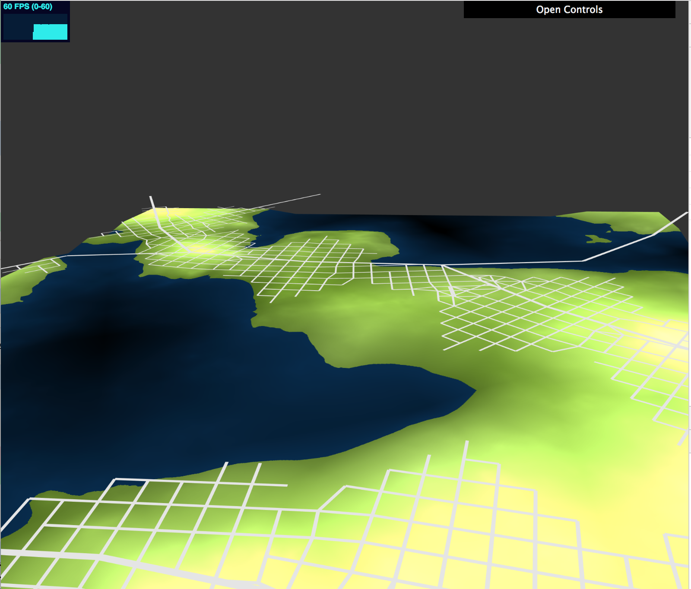
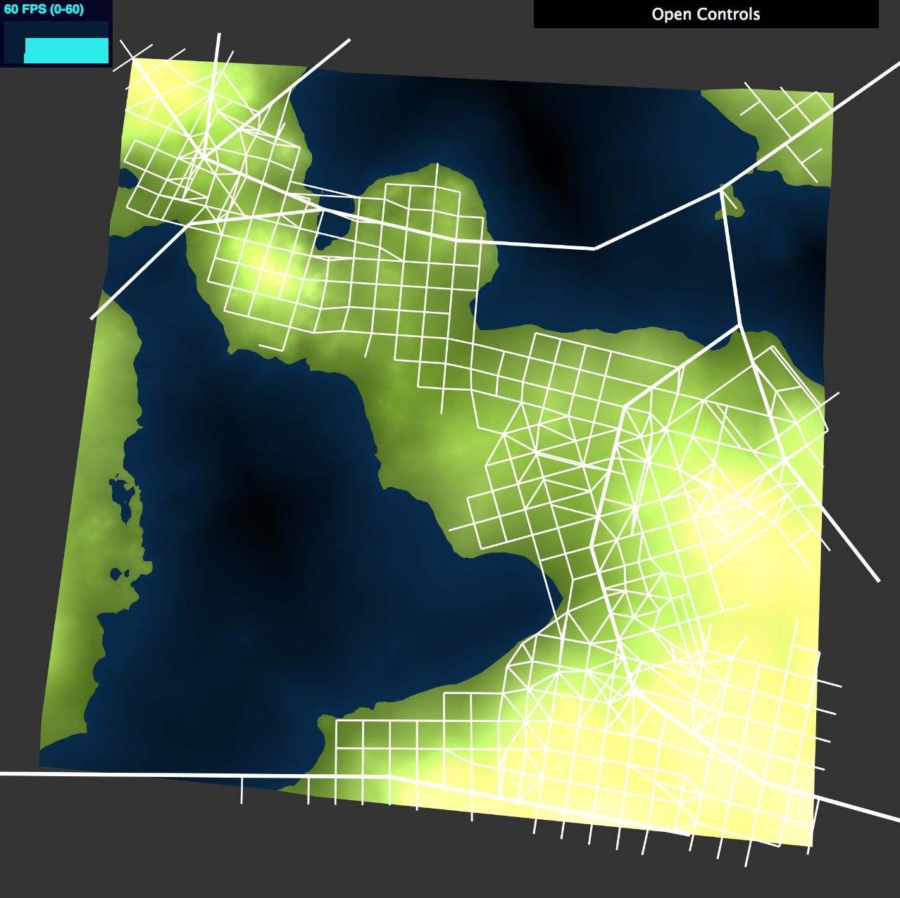
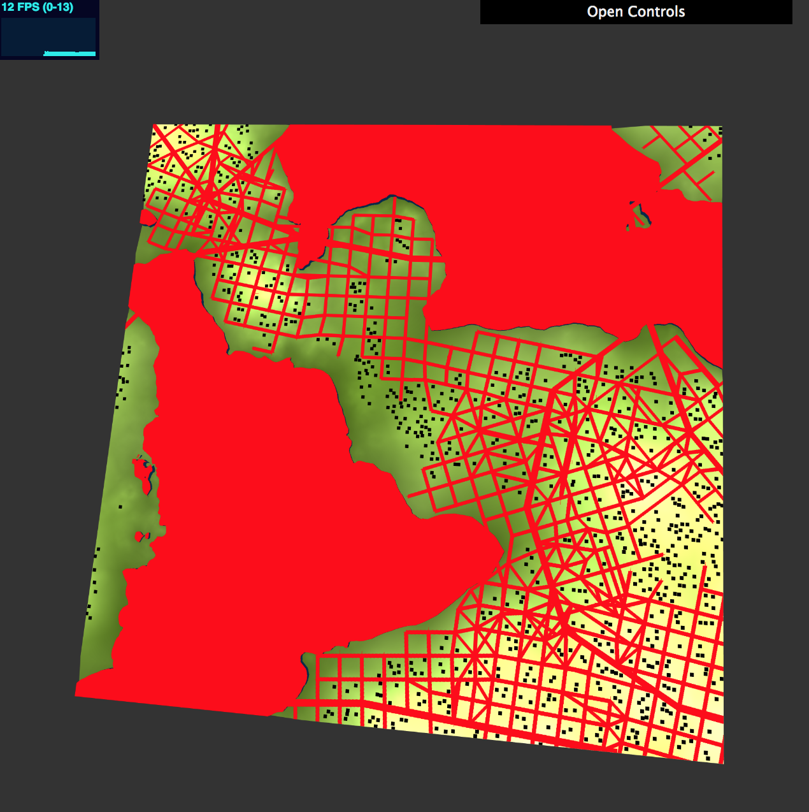
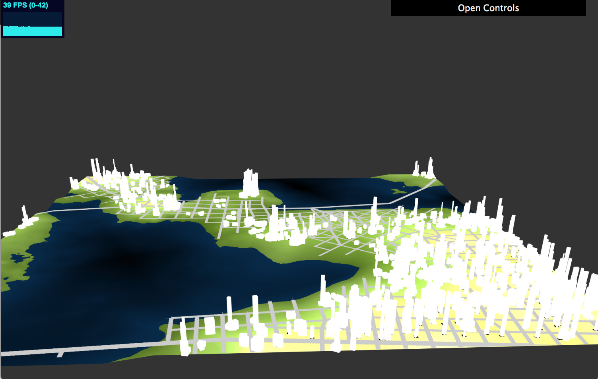
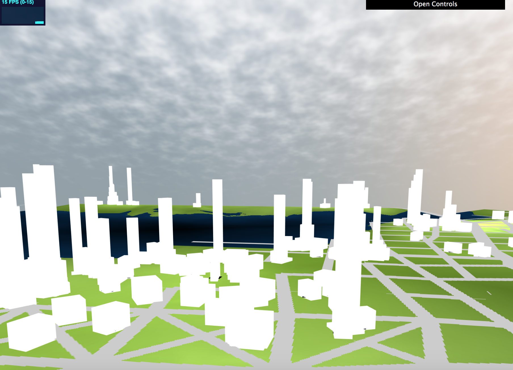
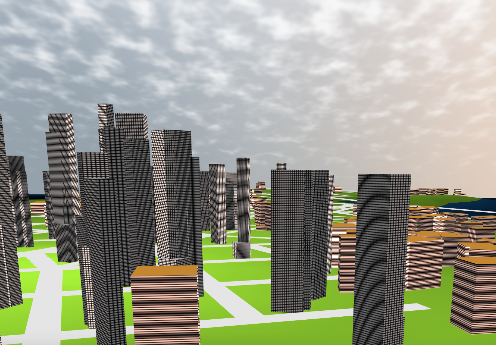
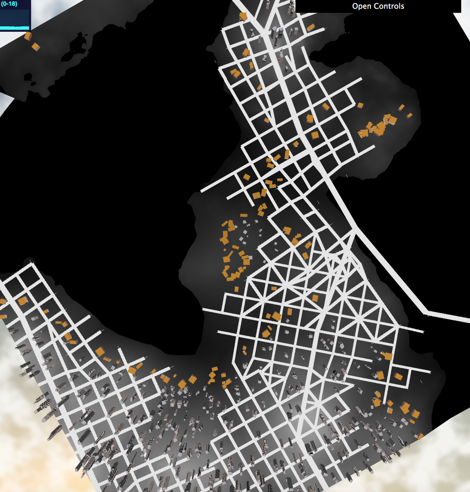

# Procedural Road Generation

### Chloe Le (chloele)
- https://chloele.com/

### Demo: 
- http://www.chloele.com/city-generation/

Note: might need to make window dimensions into a square to see the full view.

## References
Road generation is based on the paper [Procedural Modeling of Cities](https://github.com/chloele33/road-generation/blob/master/proceduralCityGeneration.pdf). 
Techniques for global and local constraints all follow the paper.

Building generation is based method illustrated in the paper [Real-time Procedural Generation of 'Pseudo Infinite' Cities](procedural_infinite_cities.pdf). 

Lighting in the scene is inspired by [IQ's article on artistic lighting](http://iquilezles.org/www/articles/outdoorslighting/outdoorslighting.htm).

## Inspiration
This project is based on two papers: [Procedural Modeling of Cities](https://github.com/chloele33/road-generation/blob/master/proceduralCityGeneration.pdf). 
and [Real-time Procedural Generation of 'Pseudo Infinite' Cities](procedural_infinite_cities.pdf). 

## Features Implemented
- 3D map with population density, terrain elevation, and land vs water view
- Road generation with instanced rendering
- 2D validity grid with rasterized roads and water
- Valid building placement
- Top-down building geometry generation
- Building appearance based on population density
- Procedurally generated building texture
- Environmental lighting
- Procedural sky background

## Implementation

### 3D Map and Road Generation

Continuing from my last project, [procedural road generation](http://www.chloele.com/road-generation/), I transformed the 2D map to be a 3D plane. 
This is done by using the subdivided plane geometry and using the camera's view projection matrix. In the shader, if water is detected on the texture, we reduce the 
y-position by a little bit to create different elevations between land vs. water with a small slope. 

Roads are still generated using the LSystem network from the previous project. To render the roads, I am using square geometry and instanced rendering with the view projection matrix * tranformations. In the vertex shader, the y position is lifted by 
a small amount to have the roads show on the 3D plane. 

### Building Placement Validity Grid and Building Placement
 

In the images above, the left figure shows the road system, and the right figure shows the rasterized validity grid. Note: red color represent water and roads (invalid areas to have buildings), and black squares represent potential building placements.  

The grid is represented with a double array with integers: 0 means empty, 1 means road, 2 means building center, 3 means water. 

To populate the grid, I first start by filling every spot with 0. Then, I check all the edges with rasterization test. For every edge, I test against entirely horizontal, entirely vertical, and sloped cases (which then I test with x and y lines against slopes). If intersection is detected, I apply a road/highway thickness to the point in all four cardinal directoins. 
This allows me to populate my grid array in both x and y directions of the intersection point with the corresponding integer (1 in this case).

After all roads are checked, I check for water by simply iterating through every pixel, and for each position, query my texture map whether the currently pixel represents water. If so, I fill the grid with number 3.  

After rasterization is done, I now have a grid that tells me exactly where is a building allowed to be placed. 
I randomly scatter an arbitrary number of points onto my grid. For each pair of x,y position I obtain, I check with the validity grid whether or not the position is valid (no water, no road, no building, and population density is above a certain threshold). In addition to checking just one pixel (x, y), I am checking (x+-building width, y+-building width) in order to make sure there is no overlap. If it is valid, I then populate (x+-building width, y+-building width) with the nubmer 2. 

### Building Geometry

All buildings are made from differently transformed cubes. And as previously mentioned above, building generation is done by following the paper's method. The method consists of follows:
   
- All valid building positions are stored in a vec2 array
   
- For each valid building position, I check whether population density is above a certain threshold. If so, a height is determined by multiplying an input height with 2 * (population density squared), and this building is going to have type "skyscraper". Otherwise, the building is going to have a reduced height of  and be labeled "non-skyscraper"(labeling is done by numbering 1's or 0's, and will be explained farther below). In addition, non-skyscrapers will double building width.

- After a height is determined for the building, I have a while loop that says: while the height is above 0, there is a small (20%) chance that an additional geometry layer will be added to the building. The additional layer is done by creating a new cube who's center will be positioned at a random vertex of the previous layer. The rotation and scaling in the x-z direction are determined randomly. 

- Update the building's height by having height = height - floorheight, where floorhiehgt is an input determined buy the programmar. 

The bullet points above make up the basic structure of the algorithm. One more key point to note is that whenever a new building block is placed, the building primitive's transformation matrix is the pushed to an array of all matrices. This array of matrices will then be used to obtain VBO data for instanced rendering. 
    

### Procedural Sky

Procedural sky is done using the sky frag and vert shader. Sun in the sky is done by taking the dot product of sun direction and ray direction, then the sun color is multiplied with the clamped sun dot product raised to a high power (8) and added to the color of the sky. 
A layer of cloud texture is added to the sky. The cloud consists of fbm and fbmperlin noises. In addition, smoothstep and mix functions are also used to create a more realistic and natural look.

### Procedural Building Texture

(showing with population map, note that skyscrapers are only located at areas with high population density)

When generating the buildings, in addition to saving the cubes' transformation matrices, i am also saving the cubes' "types". Each cube is labeled 1 or 0. A label array is saved whenever a new building primitive's tranformation matrix is saved. That way, we keep the order of the information the same.
This allows me to have the type label information as shader attributes. During instanced rendering, I create a buffer for the types and ultimately pass the information to the shader as vs_Type. 

In the building fragment shader. I ask whether this building is a skyscraper, since skyscrapers will have a different look than the shorter buildings.
When texture-ing the buildings, I check the y normal in order to decide whether it is the roof-level of the building. If not, then I continue to generate 
colors with worley noises and taking the power of sine and cosine functions. The sin and cos functions, combined with worley noise and the world position's x-y points allow me to create the stripes and grids on the buildings that resemble windows.

### Environmental Lighting

Lastly, environmental lighting is implemented to illuminate the scene. There are two directional lights that are located near the sun. For each light, I am combining ambient, diffuse, and indirect lighting to create the output color, which is then combined with the building's texture color 

### Instanced Rendering
The road network and cubes for the buildings are rendered using instanced rendering. Instanced shader takes in four transformations' columns from our geometry. Other classes such as Drawable, Square, and ShaderProgram all have been modified to adapt to instanced rendering. 
They now save the transformation matrix's columns as four vec4's, and extra buffers for the four columns are generated and binded.

To render the road network, I am getting VBO data from LSystem's getVBO() function. This function basically considers all edges in one go, and returns the four column arrays and colors array from all the edges' transformation data. 
In the Edge class, we can get each edge's transformation matrix by using the getTransform() function. 

To render the buildings, I am saving each cube's transformation matrix, and eventually passed into buffers in a way similar to the edges. 

### Interactive GUI
The user can interact with
  - different map views (which are uniform toggle booleans sent to the shaders)
  - highway length, road length, number of iterations
  - local constraint coefficients for snap and extending road segments. The bigger the coefficients, the longer the serach distance and tendency to snap/extend the segment. 
  - road and highway thickness
 
